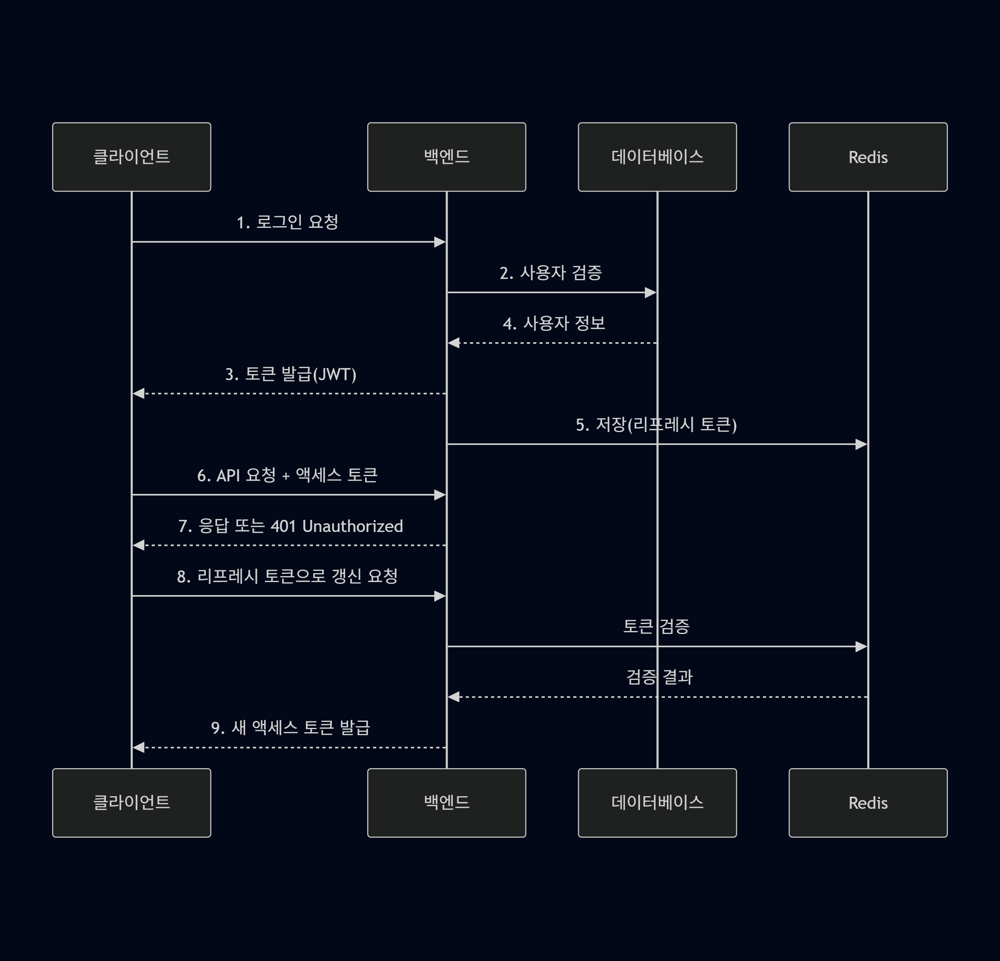
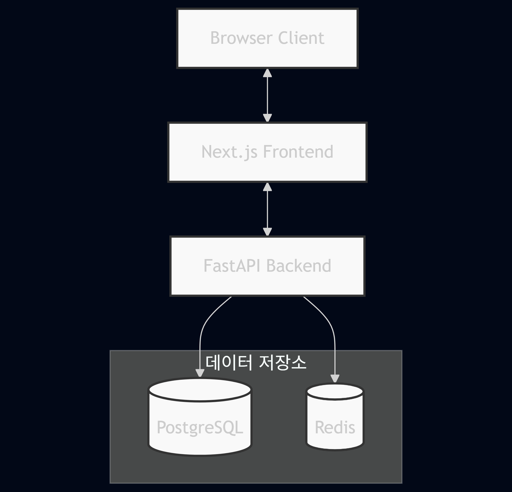

# Movie Service - JWT 인증 시스템

Next.js와 FastAPI를 이용한 영화 서비스 애플리케이션으로, JWT + Refresh Token + Redis를 활용한 안전한 인증 시스템을 갖추고 있습니다.

## 기술 스택

### 백엔드
- **FastAPI**: 고성능 Python 웹 프레임워크
- **SQLAlchemy**: SQL 툴킷 및 ORM
- **PostgreSQL**: 관계형 데이터베이스
- **Redis**: 리프레시 토큰 및 토큰 블랙리스트 관리
- **JWT**: JSON Web Token 기반 인증
- **Pydantic**: 데이터 검증

### 프론트엔드
- **Next.js**: React 기반 풀스택 프레임워크
- **React**: 사용자 인터페이스 구축
- **TailwindCSS**: 유틸리티 기반 CSS 프레임워크
- **React Hook Form**: 폼 처리
- **Axios**: HTTP 클라이언트
- **SWR**: 데이터 페칭

## 주요 기능

- **JWT + Refresh Token 인증**: 액세스 토큰과 리프레시 토큰을 활용한 안전한 인증
- **Redis 활용**: 토큰 블랙리스트 및 리프레시 토큰 저장
- **자동 토큰 갱신**: 액세스 토큰 만료 시 자동 갱신
- **사용자 관리**: 회원가입, 로그인, 로그아웃, 프로필 조회

## 인증 시스템 구조

### 개요
이 시스템은 JWT를 기반으로 한 액세스 토큰과 리프레시 토큰을 사용하여 보안성과 사용자 경험 사이의 균형을 맞추도록 설계되었습니다.

### 인증 흐름

1. **로그인 프로세스**:
   - 사용자가 로그인하면 서버는 두 가지 토큰을 생성합니다:
     - **액세스 토큰**: 짧은 수명(30분)을 가지며 사용자 식별에 사용
     - **리프레시 토큰**: 긴 수명(7일)을 가지며 새 액세스 토큰 발급에 사용
   - 액세스 토큰은 클라이언트에 반환됩니다
   - 리프레시 토큰은 Redis에 `refresh_token:{user_id}` 형태로 저장됩니다

2. **API 요청 인증**:
   - 클라이언트는 모든 보호된 API 요청에 액세스 토큰을 포함시킵니다
   - 서버는 액세스 토큰을 검증하여 요청을 인증합니다
   - 액세스 토큰이 만료되면 자동으로 리프레시 토큰을 사용하여 갱신합니다

3. **토큰 갱신 프로세스**:
   - 액세스 토큰이 만료되면 클라이언트는 리프레시 API를 호출합니다
   - 서버는 Redis에서 저장된 리프레시 토큰과 비교하여 검증합니다
   - 유효한 경우 새로운 액세스 토큰과 리프레시 토큰을 발급합니다

4. **로그아웃 처리**:
   - 사용자가 로그아웃하면 리프레시 토큰은 Redis에서 삭제됩니다
   - 현재 액세스 토큰은 블랙리스트에 등록됩니다 (`blacklist:{token}` 형태)
   - 블랙리스트에 등록된 토큰은 유효 기간이 남아있어도 사용할 수 없습니다

### 보안 특징

- **토큰 저장 분리**: 액세스 토큰은 클라이언트에, 리프레시 토큰은 서버 Redis에 저장
- **짧은 액세스 토큰 수명**: 토큰 탈취 위험 최소화
- **토큰 블랙리스트**: 로그아웃된 토큰의 재사용 방지
- **Redis 활용**: 고성능 토큰 관리 및 검증

### 인증 상태 다이어그램


## 시스템 아키텍처



## 폴더 구조

```
movie_service/
├── frontend/              # Next.js 프론트엔드
│   ├── public/            # 정적 파일
│   │   ├── app/           # App Router 구조
│   │   ├── components/    # 재사용 가능한 컴포넌트
│   │   ├── contexts/      # 컨텍스트 (AuthContext 등)
│   │   ├── hooks/         # 커스텀 훅 (useAuth 등)
│   │   ├── lib/           # 유틸리티 함수
│   │   ├── services/      # API 서비스
│   │   └── types/         # 타입 정의
│   ├── .env.local         # 환경 변수
│   └── next.config.ts     # Next.js 설정
├── backend/               # FastAPI 백엔드
│   ├── app/
│   │   ├── api/           # API 엔드포인트
│   │   │   ├── routes/    # 라우트 정의
│   │   │   └── deps.py    # 의존성 주입
│   │   ├── core/          # 핵심 설정
│   │   │   ├── config.py  # 환경 설정
│   │   │   ├── security.py# 보안 관련 유틸리티
│   │   │   └── auth.py    # 인증 관련 유틸리티
│   │   ├── db/            # 데이터베이스
│   │   │   ├── session.py # DB 세션
│   │   │   └── redis.py   # Redis 연결
│   │   ├── models/        # 데이터 모델
│   │   ├── schemas/       # Pydantic 스키마
│   │   ├── services/      # 비즈니스 로직
│   │   └── main.py        # 애플리케이션 진입점
│   ├── requirements.txt   # 파이썬 의존성
│   └── Dockerfile         # 백엔드 Docker 설정
├── docker-compose.yml     # Docker Compose 설정
└── README.md              # 이 파일
```

## 설치 및 실행 방법

### 사전 요구사항

- Docker 및 Docker Compose
- Python 3.11 이상 (로컬 개발용)
- Node.js 20 이상 (로컬 개발용)

### Docker Compose로 실행하기

```bash
# 전체 시스템 실행
docker-compose up

# 백그라운드로 실행
docker-compose up -d

# 서비스 중지
docker-compose down
```

### 로컬에서 개발하기

**백엔드:**

```bash
cd backend
pip install -r requirements.txt
python -m uvicorn app.main:app --reload
```

**프론트엔드:**

```bash
cd frontend
npm install
npm run dev
```

## API 엔드포인트

### 인증 관련

- `POST /api/v1/auth/login`: 로그인 및 토큰 발급
- `POST /api/v1/auth/refresh`: 리프레시 토큰을 이용한 액세스 토큰 갱신
- `POST /api/v1/auth/logout`: 로그아웃 (토큰 블랙리스트 등록)

### 사용자 관련

- `POST /api/v1/users/`: 새 사용자 등록
- `GET /api/v1/users/me`: 현재 인증된 사용자 정보 조회
- `PUT /api/v1/users/me`: 현재 인증된 사용자 정보 업데이트

## 보안 특징

- **액세스 토큰**: 짧은 만료 시간 (30분)
- **리프레시 토큰**: 긴 만료 시간 (7일)
- **Redis 블랙리스트**: 로그아웃한 토큰 관리
- **토큰 자동 갱신**: 인증 상태 유지

## 라이선스

이 프로젝트는 MIT 라이선스 하에 제공됩니다. 자세한 내용은 [LICENSE](LICENSE) 파일을 참조하세요. 